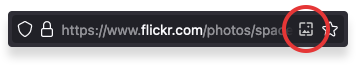

# ImgFullRes - a Firefox add-on

<!-- logo -->

   
   

**ImgFullRes** is a tiny add-on for Firefox, which can extract images from websites.

You will find a small icon the browser's URL bar on supported sites. Click it, and the image(s) will be opened in the highest available resolution in a new tab.  

Really useful on websites, which block right-clicking or only show a scaled-down version of the image.

## Supported Websites
* 1x.com
* 500px.com
* behance.net
* everydaycarry.com
* flickr.com
* fotocommunity.de
* fstoppers.com
* instagram.com
* nzz.ch
* tagesschau.de
* zeit.de

## Contribution

### Adding new websites
If you want to include additional websites,

1. have a look at the scripts inside the `websites/` folder and add a new script for the site to add.
2. Add the script and a RegEx for the url to the `sites` constant inside `background.js`
3. Add the website to this readme.

When all this is done, you can submit a pull request.

### Translations
You're welcome to translate the few strings this add-on uses, by submitting a pull request with the added language file inside `_locales`.
